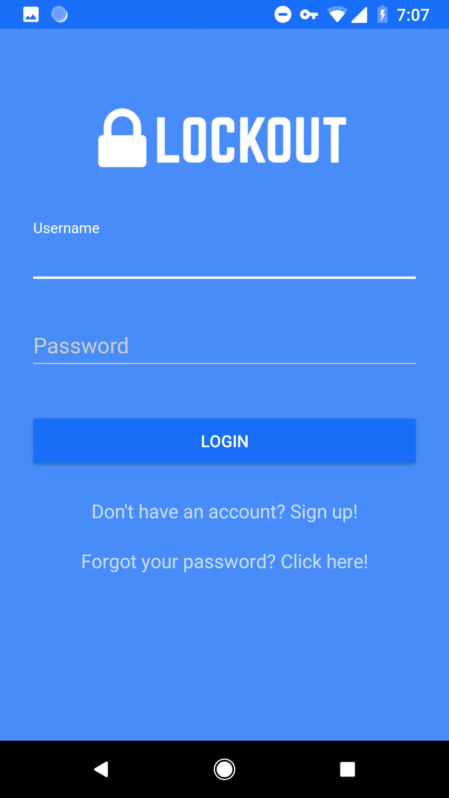

# Lockout (BETA)

  

Lockout is currently in the process of being developed! It will be an entirely new way to focus and be mindful of your digital health in this new era of technology.

Originally, Lockout served as an app to motivate people to focus or study, and earn rewards while doing so! The specific use case the prototype was designed for was academic interactions (professor and students, TAs and class-members, etc). However, it was left open enough to be used for other similar interactions as well (Parents and children, etc).

A student could enter lockout mode, and earn points while their phone stayed in lockout mode. These points could be used to redeem store items, such as extra credit given by a teacher, and so on. Students could also join groups and add their friends, while visualizing their study habits and their friends' study habits as well. Leaderboards were also implemented.

More on the direction the app is now headed, a user could set a morning motivational message of their choice. Additionally, to earn twice as many points, they could enter focused lockout mode, and block distracting apps from their phone.

## Screenshots

## Stuff for Nerds

The current version is a prototype created natively for android with material design styling. Back-end used to be Spring/Maven framework, but the new app will have a different back end. Additional functionality to move it from a development version to a fully functional digital health app is in the works for a launch this year!

## Want to try it on your own?

Well, sadly, you can't. This section will updated as soon as you can. The login and server functions are broken due to the server lease expiring, but a limited functionality open-source version that doesn't require the server will be uploaded as soon as possible. Premium features such as focus mode will not be uploaded as they will be saved for the official launch this year.

## Credits
UX/Prototyping/Development: Jay Amin
Client-Server Calls: Mark O'Meara and Jay Amin
Graphic Design/Branding: Jay Amin
Server: Joshua Bill and Andy Koenen
Oversight: TA Vamsi Calpakkam and Professor Simanta Mitra at Iowa State University
